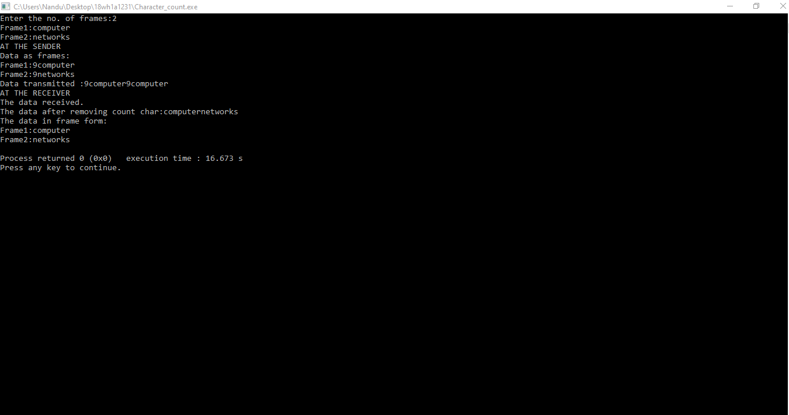

# Experiment1

## Aim:
Implement the data link layer framing methods such as character, character-stuffing and bit
stuffing.

### Steps/Procedure:

1.Read the number of frames and data in each frame.

2.At the sender side, add 1 to the size of each frame which gives the header. Print the data tranmsitted as header and data in that frame respectively.

3.At the reciever side, print data received, by printing the data removing the character count and data in frame form following it.

OUTPUT:

