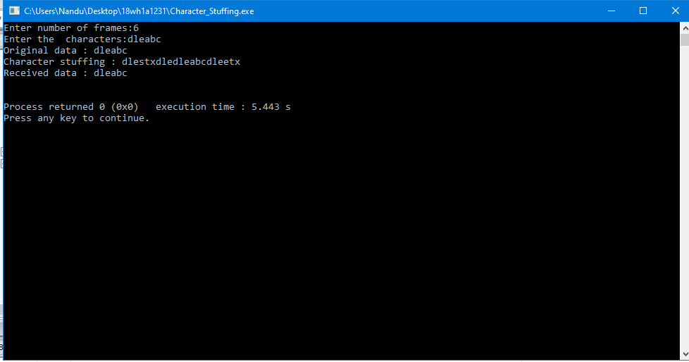
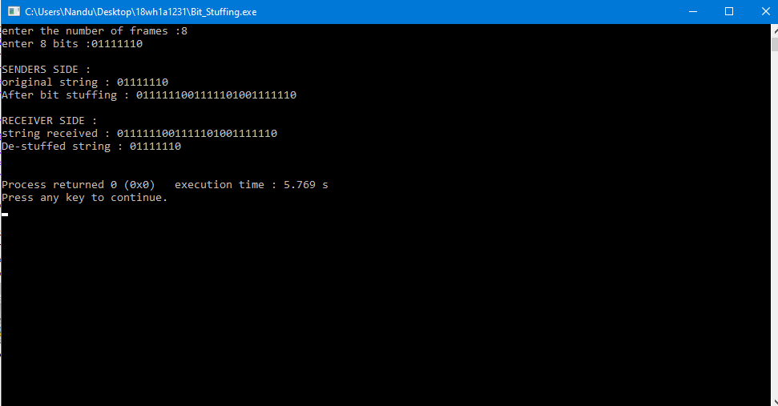

# Experiment1

## Aim:
Implement the data link layer framing methods such as character count, character-stuffing and bit
stuffing.

### Steps/Procedure:

### 1.Character count

1.Read the number of frames and data in each frame.

2.At the sender side, add 1 to the size of each frame which gives the header. Print the data tranmsitted as header and data in that frame respectively.

3.At the reciever side, print data received, by printing the data removing the character count and data in frame form following it.

OUTPUT:

 

### 2.Character stuffing

1.Read the number of frames and data in each frame.

2.At the sender side, add the starting delimiter as "DLESTX" and ending delimiter as "DLEETX".If the original data contains "DLE" as sub-string, add an extra "DLE" before it.

3.At the receiver side, remove the delimiters and extra "DLE's" added at the sender side.This becomes the original data sent by the sender.

4.we use delimiters to help receiver know start and end points of the data sent.

OUTPUT:

 

### 3.Bit stuffing

1.Read the number of frames and data in each frame.

2.In the data, if five consecutive ones are encountered, stuff zero after them so that they are not considered as flag bits by the receiver.

3.At the sender side, add flag bits at the start and end of stuffed data and send it to the receiver.

4.At the receiver side, de-stuff(remove the stuffed zeroes after five consecutive ones) the received data and remove the flag bits.

5.This becomes the original data sent by the sender.

OUTPUT :

