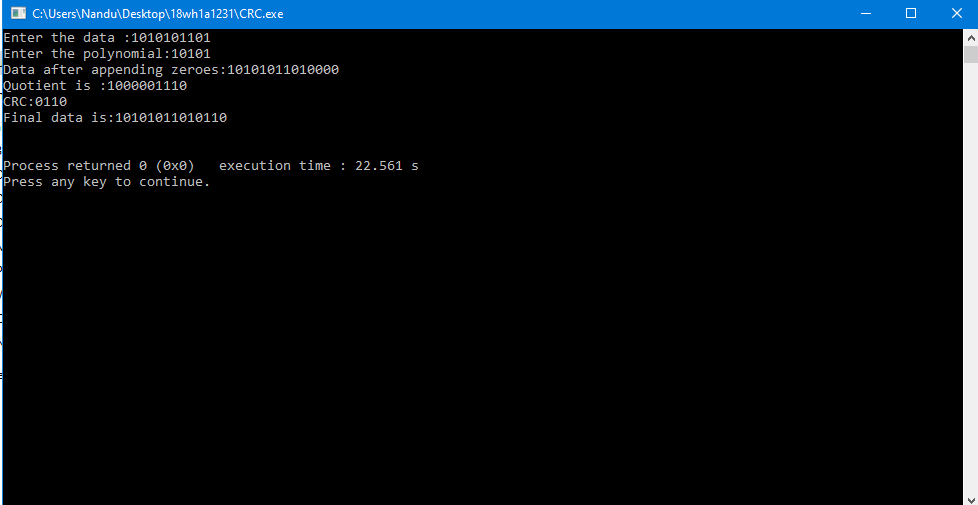

# Experiment 2
## Aim : 
 To compute CRC code for the polynomials CRC-12, CRC-16 and CRC CCIP.
 
### Steps/Procedure :
1. Read the data(frame) from the user.

2. Read the polynomial in binary form from the user.

3. Calculate the length of polynomial and add zeroes equal to one less than length of polynomial to the input data(frame).

4. If the frame is starting with '1', exclusive-or the frame with polynomial.

5. If the frame starts with '0', exclusive-or the frame with zeroes equal to length of polynomial.

6. Compute the quotient and remainder.

7. The remainder is called CRC(Cyclic Redundancy Check). Add this CRC to the frame taken from the user which becomes the CRC code.

8. Print the computed values and the final data as output.

OUTPUT:

