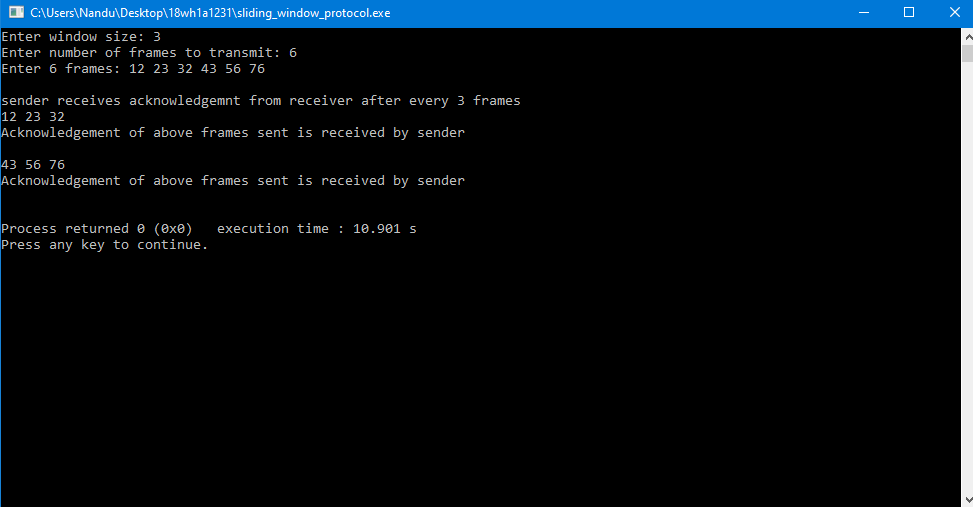

# Experiment3

## Aim:
Write a C program to develop a simple data link layer that performs the flow control using the sliding window protocol, and loss recovery using the Go-Back-N mechanism.

### Steps and procedure:

#### Sliding window protocol:
The sliding window is a technique for sending multiple frames at a time. It controls the data packets between the two devices where reliable and gradual delivery of data frames is needed.
In this protocol the window size on the receivers side and senders side is of equal length. When a sender sends number of frames equal to the window size the receiver sends acknowledgement for the frames received. After receiving acknowledgement from the receiver, the sender sends another window to the receiver. This continues till all frames on the senders side are transmitted.

output:

#### Go-Back_N protocol:
In this protocol the sender first sends all the frames without waiting for acknowledgement.After sending all the frames the sender waits for acknowledgement. If the receiver misses one frame and acknwledges receiver about it then the sender sends all the frames from the frame number that the receiver missed.

output:

